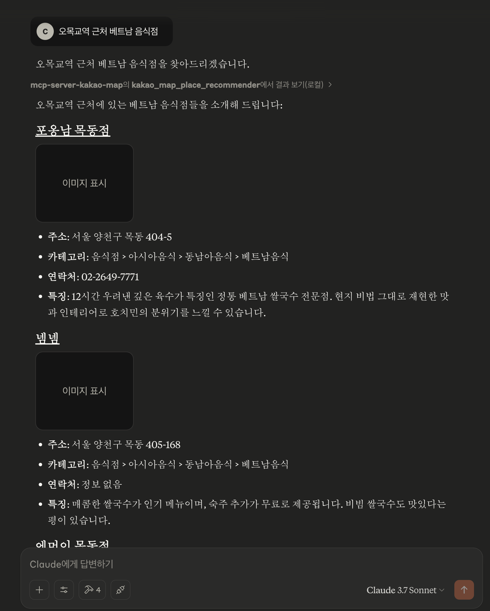

Kakao Map MCP Server

English | [한국어]('./docs/ko.md') 

MCP Server for the Kakao Map API, enabling location-based place recommendations within South Korea. Optimized for Korean language queries.

## Tool: kakao_map_place_recommender

Description: Recommends various relevant places (e.g., restaurants, shops, public facilities, attractions) in South Korea based on user queries seeking suggestions. Uses the Kakao Map API keyword search.

- `query` (required): Korean keywords describing the type of place and location. Examples: '이태원 맛집', '서울 병원', '강남역 근처 카페'.

## Configuration

### Environment Variables

- `KAKAO_API_KEY`: Your kakao API key (required)

1.  Register Application: Go to Kakao Developers (https://developers.kakao.com/), log in, and create an application (https://developers.kakao.com/docs/latest/ko/getting-started/quick-start#create) if you don't already have one.
2.  Get REST API Key: Navigate to your application's settings: `[My Applications] > [App Settings] > [Summary]`. Find and copy the REST API Key from the list of keys provided. This specific key is required for the tool.
3.  Enable Kakao Map API: Ensure the Kakao Map API is enabled for your application. Go to `[My Applications] > [Kakao Map] > [Activation Settings]` and set the `[Status]` to `ON`. (*Note: If adding the API to an existing app, additional permission requests might be necessary.*)
4.  Reference: For more details, consult the Kakao Local API Common Guide (https://developers.kakao.com/docs/latest/ko/local/common).